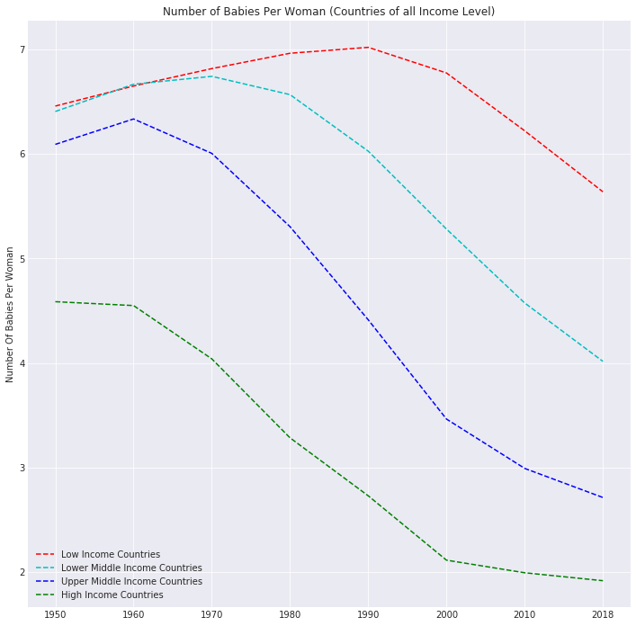
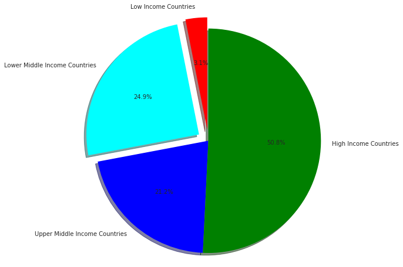

# Udacity-Investigate-a-Dataset

## Overview

Analyzing the relationship between Longeviy, Fertility Rate and Economic Growth, 
for all countries. grouped by Income Levels.
The analysis goes from the 1950's. 

## Install

In order to replicate 
* Jupyter notebook
* Pandas
* Numpy
* Matplotlib
* Seaborn
 
 ## Important Files
 
 Files included in the repository are the csv files
 1. children_per_woman_total_fertility.csv
 2. income_per_person_gdppercapita_ppp_inflation_adjusted.csv
 3. gdp_total_yearly_growth.csv
 4. life_expectancy_years.csv
 5. jupyter notebook file
 6. pdf version of the analysis
 7. Html Version of the analysis
 8. Vizualisations
 
 ## visualizations 
The following visualizations are some of the visualization included
  
 
 
 

 
 ## References and Citations
 
 * The countries were grouped based on the world bank new country classification by income level
 https://blogs.worldbank.org/opendata/new-country-classifications-income-level-2018-2019
 * All the datasets used were extracted from Gapminder
 https://www.gapminder.org/data/
